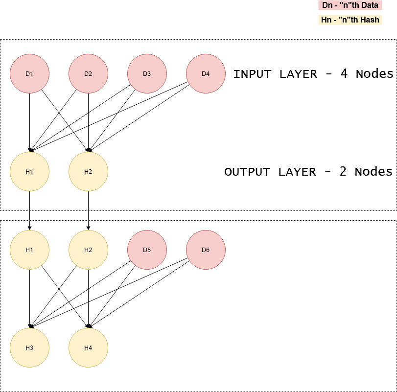

# FNN-Hash (Flexible Neural Network - Hash)

A flexible **EXPERIMENTAL** Hashing algorithm that uses Neural Network architecture to calculate the Hash of a given string.

### BUT WHY make such a thing???

* Neural Networks are intresting<br>
* I think of Neural networks as **chaos mappers**
(things that can map/guess chaos--- dosent make sense I know but i just think of them that way)<br>
* and Neural Networks can be modified to do lot of things (as you can see with this current project)
* and i love to do cryptography related stuff.

### Intern Working and Structure



### Some Notes
* *the node activation function is a threshold gate.*
* *the number of nodes in inputlayer = 2 x no. of nodes in outout layer* 
* *and those number of nodes changed by user easily thus changing the size of hash generated.(max size = 1024)*

### Requirements

* make sure you have `NUMPY` (Thise was made on version `1.19.2`)

### HOW TO USE

1. drop the python file `FNNH.py` in the same directory of the file you want to use it with.
2. and to use the algo write :
```python
from FNNH import FNNH

data = "qwerty"
sizeofhash = 16

thehash = FNNH(data,sizeofhash)
```